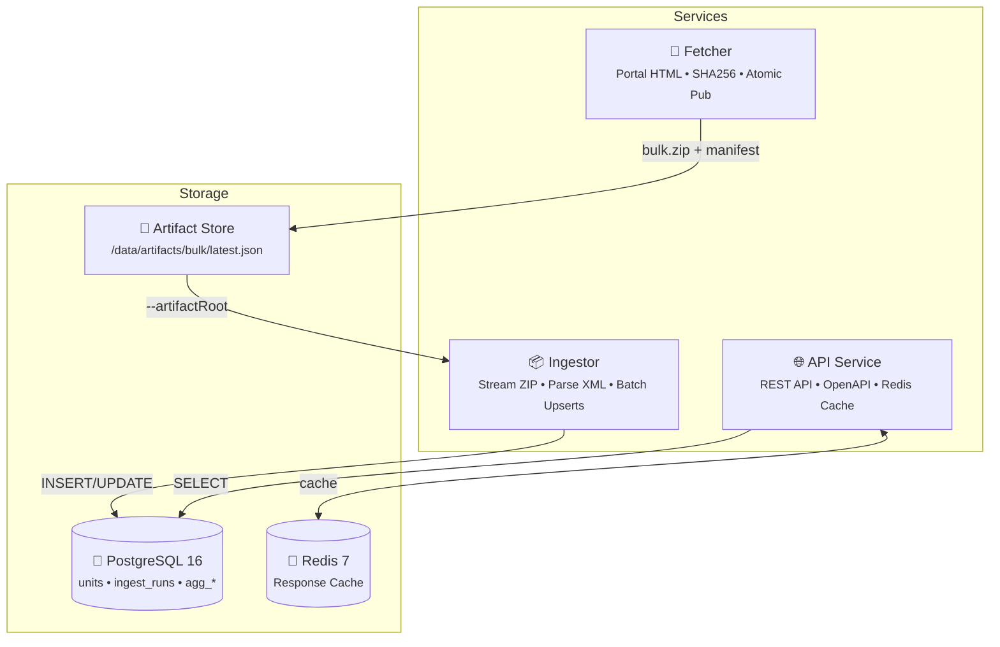

# Energy-Unit Statistics Platform

A production-grade MVP for tracking and analyzing energy unit statistics in Germany. This platform automatically downloads bulk XML data exports from the MaStR portal, processes them, stores the data in a normalized database, and exposes aggregated statistics via a read-only REST API.

## 🏗️ Architecture



## 📋 Prerequisites

- **Docker** (with Docker Compose)
- **Node.js** >= 20.0.0
- **pnpm** >= 9.0.0

## 🚀 Quick Start

```bash
pnpm install           # Install dependencies
docker compose up -d   # Start PostgreSQL & Redis
pnpm db:migrate        # Run database migrations
pnpm demo:generate     # Create demo-data/bulk.zip
pnpm ingest:demo       # Ingest demo data
pnpm --filter @energy/api dev  # Start API
```

**One-Command Demo:**

```bash
pnpm demo:up
```

---

## 🔄 Fetcher Service

Downloads bulk ZIP files from the MaStR portal with streaming download, SHA256 validation, and atomic publish.

```bash
npx tsx services/fetcher/src/cli.ts fetch-bulk \
  --portalUrl https://www.marktstammdatenregister.de/MaStR/Datendownload \
  --artifactRoot /data/artifacts
```

---

## 📥 Ingestor Service

Processes ZIP files and loads data into PostgreSQL with streaming XML parsing and batched upserts.

```bash
# From artifact store
npx tsx services/ingestor/src/cli.ts --artifactRoot /data/artifacts

# Direct ZIP path
npx tsx services/ingestor/src/cli.ts --bulkPath /path/to/bulk.zip --exportDate 2026-01-07
```

### Features

- Streaming ZIP/XML processing (memory efficient)
- UTF-8 and UTF-16 support
- Split file handling (`_1.xml`, `_2.xml`)
- Batched upserts (500 records)
- Stable SHA256 hashing for change detection
- Aggregate table rebuilding

---

## 📡 API Service

REST API with OpenAPI documentation and Redis caching.

```bash
pnpm --filter @energy/api dev
```

| Endpoint               | Description   |
| ---------------------- | ------------- |
| `GET /.well-known/api` | API discovery |
| `GET /openapi.json`    | OpenAPI spec  |
| `GET /docs`            | Swagger UI    |
| `GET /health`          | Health check  |

---

## 🧪 Testing

```bash
pnpm test              # 33 unit tests
pnpm test:integration  # Integration tests (requires Docker)
```

---

## 📁 Project Structure

```
.
├── docker-compose.yml
├── db/migrations/
├── packages/shared/           # Types and utilities
├── services/
│   ├── fetcher/               # Bulk ZIP downloader
│   ├── ingestor/              # XML processor
│   └── api/                   # REST API
├── scripts/
│   ├── migrate.ts
│   └── generateDemo.ts
└── test/integration/
```

---

## 🔐 Environment Variables

| Variable            | Default                  | Description         |
| ------------------- | ------------------------ | ------------------- |
| `POSTGRES_HOST`     | `localhost`              | PostgreSQL host     |
| `POSTGRES_PORT`     | `5432`                   | PostgreSQL port     |
| `POSTGRES_USER`     | `energy`                 | Database user       |
| `POSTGRES_PASSWORD` | `energy`                 | Database password   |
| `POSTGRES_DB`       | `energy`                 | Database name       |
| `REDIS_URL`         | `redis://localhost:6379` | Redis URL           |
| `API_PORT`          | `3000`                   | API port            |
| `CACHE_TTL`         | `300`                    | Cache TTL (seconds) |
| `PORTAL_URL`        | MaStR URL                | Fetcher portal URL  |
| `ARTIFACT_ROOT`     | `/data/artifacts`        | Artifact store root |

---

## 📈 Production Flow

1. **Fetcher** runs daily (cron or scheduler)
   - Downloads new bulk ZIP from MaStR portal
   - Publishes to `/data/artifacts/bulk/`
2. **Ingestor** runs after fetcher
   - Reads from `--artifactRoot`
   - Verifies SHA256, loads `latest.json`
   - Processes ZIP, updates database
3. **API** serves aggregated statistics
   - Reads from PostgreSQL
   - Caches responses in Redis

```bash
# Example production workflow
npx tsx services/fetcher/src/cli.ts fetch-bulk --artifactRoot /data/artifacts
npx tsx services/ingestor/src/cli.ts --artifactRoot /data/artifacts
```

---

## 📝 License

MIT
