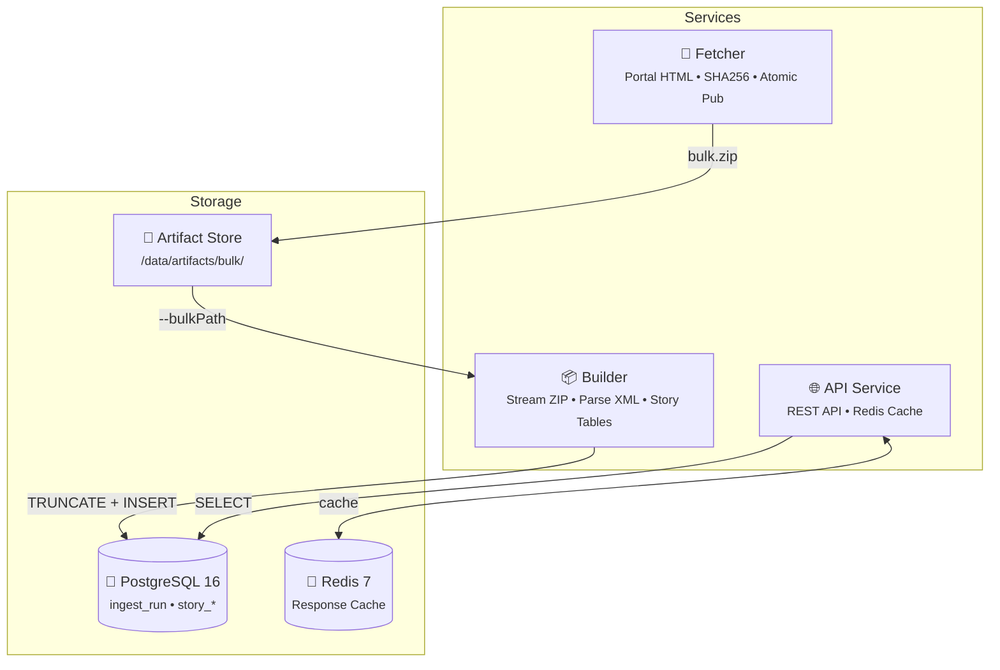

# Energy-Unit Statistics Platform

A **story-first** energy statistics platform based on nightly bulk ZIP/XML imports. This is a data-mart approach optimized for storytelling pages and viral dashboards.

## 🎯 Philosophy

**No large canonical layer for all objects.** Instead:

- Keep only **minimal core tables** (run metadata + location lookups)
- Build **story tables** directly from XML parsing, one story at a time
- Nightly job does **full rebuild**: `TRUNCATE story tables → parse XML → INSERT aggregated rows`
- The API reads **only story tables** (fast, simple, stable)

---

## 🏗️ Architecture



---

## 📋 Prerequisites

- **Docker** (with Docker Compose)
- **Node.js** >= 20.0.0
- **pnpm** >= 9.0.0

---

## 🚀 Quick Start

```bash
pnpm install           # Install dependencies
docker compose up -d   # Start PostgreSQL & Redis
pnpm db:migrate        # Run database migrations
pnpm demo:generate     # Create demo-data/bulk.zip
pnpm builder:demo      # Build story tables from demo data
pnpm --filter @energy/api dev  # Start API
```

**One-Command Demo:**

```bash
pnpm demo:up
```

This will:

1. Start PostgreSQL + Redis
2. Apply migrations (core + story tables)
3. Generate demo bulk.zip (100 storage + 200 solar units)
4. Build story tables
5. Start the API

---

## 📊 Story Tables (the product)

| Story                | Table                            | Description                                     |
| -------------------- | -------------------------------- | ----------------------------------------------- |
| **Storage Wave**     | `story_storage_day_region`       | Daily storage additions by bundesland           |
| **Solar Wave**       | `story_solar_day_region`         | Daily solar additions by bundesland             |
| **Colocation**       | `story_storage_colocation_month` | Storage-solar co-location rates                 |
| **Registration Lag** | `story_registration_lag_month`   | P50/P90 lag days (commissioning → registration) |

---

## 📦 Builder Service

Parses ZIP/XML and populates story tables with a **full rebuild** approach.

```bash
# Run builder on demo data
pnpm builder:demo

# Run builder with custom path
npx tsx services/builder/src/cli.ts \
  --bulkPath /path/to/bulk.zip \
  --exportDate 2026-01-08 \
  --stories storageWave,solarWave
```

### Supported XML Files

| Pattern                       | Content                            |
| ----------------------------- | ---------------------------------- |
| `EinheitenStromSpeicher*.xml` | Storage units                      |
| `EinheitenSolar*.xml`         | Solar units                        |
| `Netzanschlusspunkte*.xml`    | Connection points (for DSO lookup) |

---

## 📡 API Endpoints

| Endpoint                                                     | Description                |
| ------------------------------------------------------------ | -------------------------- |
| `GET /health`                                                | Health check               |
| `GET /meta`                                                  | Latest ingest_run info     |
| `GET /stories/storage/wave?start=&end=`                      | Storage wave by day+region |
| `GET /stories/solar/wave?start=&end=`                        | Solar wave by day+region   |
| `GET /stories/storage/colocation?startMonth=&endMonth=`      | Co-location stats          |
| `GET /stories/lag?tech=storage\|solar&startMonth=&endMonth=` | Registration lag           |

All endpoints are cached in Redis with `x-cache: hit|miss` header.

---

## 🧩 Adding a New Story

1. **Create the story table** in `db/migrations/`:

   ```sql
   CREATE TABLE IF NOT EXISTS story_my_story (
     export_date DATE NOT NULL,
     ...
     PRIMARY KEY (export_date, ...)
   );
   ```

2. **Create the builder** in `services/builder/src/stories/myStory.ts`:

   ```typescript
   export function createMyStoryBuilder(): StoryBuilder<RecordType> {
     return {
       name: 'myStory',
       filePatterns: [/^EinheitenXXX.*\.xml$/i],
       onRecord(record) {
         /* aggregate */
       },
       finalizeAndWrite(pool, exportDate) {
         /* bulk insert */
       },
       reset() {
         /* clear state */
       },
     };
   }
   ```

3. **Register in pipeline.ts** (add to builder initialization and story writing)

4. **Add API endpoint** in `services/api/src/routes/stories.ts`

---

## 🔐 Environment Variables

| Variable            | Default                  | Description         |
| ------------------- | ------------------------ | ------------------- |
| `POSTGRES_HOST`     | `localhost`              | PostgreSQL host     |
| `POSTGRES_PORT`     | `5432`                   | PostgreSQL port     |
| `POSTGRES_USER`     | `energy`                 | Database user       |
| `POSTGRES_PASSWORD` | `energy`                 | Database password   |
| `POSTGRES_DB`       | `energy`                 | Database name       |
| `REDIS_URL`         | `redis://localhost:6379` | Redis URL           |
| `API_PORT`          | `3000`                   | API port            |
| `CACHE_TTL`         | `300`                    | Cache TTL (seconds) |

---

## 🧪 Testing

```bash
pnpm test              # Unit tests
pnpm test:integration  # Integration tests (requires Docker)
```

---

## 📈 Production Flow

1. **Fetcher** runs daily (cron)
   - Downloads new bulk ZIP from MaStR portal
   - Publishes to artifact store

2. **Builder** runs after fetcher
   - Reads bulk.zip with `--bulkPath`
   - TRUNCATE + INSERT story tables
   - Marks ingest_run as success/failed

3. **API** serves story data
   - Reads from story tables
   - Caches responses in Redis (TTL 5 min)

---

## 📝 License

MIT
