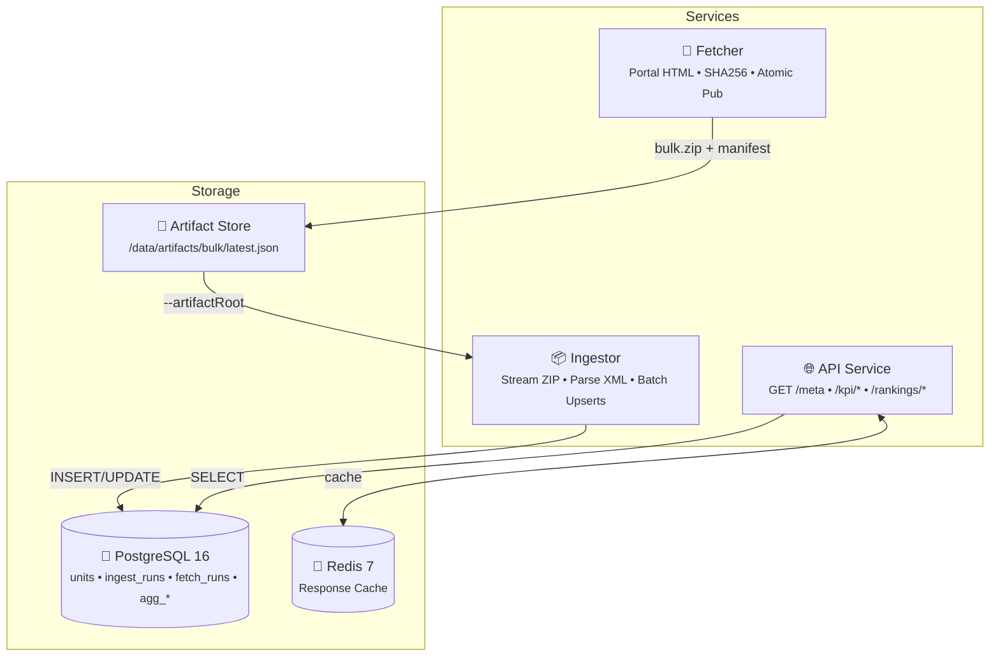

# Energy-Unit Statistics Platform

A production-grade MVP for tracking and analyzing energy unit statistics in Germany. This platform automatically downloads bulk XML data exports from the MaStR portal, processes them, stores the data in a normalized database, and exposes aggregated statistics via a read-only REST API.

## 🏗️ Architecture



## 📋 Prerequisites

- **Docker** (with Docker Compose)
- **Node.js** >= 20.0.0
- **pnpm** >= 9.0.0

## 🚀 Quick Start

### 1. Install Dependencies

```bash
pnpm install
```

### 2. Start Infrastructure

```bash
docker compose up -d
```

### 3. Run Migrations

```bash
pnpm db:migrate
```

### 4. Demo with Local Data

```bash
pnpm demo:generate   # Create demo-data/bulk.zip
pnpm ingest:demo     # Ingest demo data
pnpm --filter @energy/api dev
```

### One-Command Demo

```bash
pnpm demo:up
```

---

## 🔄 Fetcher Service

The **fetcher** automatically downloads bulk ZIP files from the MaStR portal.

### Features

- Parses portal HTML to extract download URL and timestamp
- Streaming download with SHA256 computation
- ZIP validation (magic bytes `PK\x03\x04`)
- Atomic publish (prevents partial reads)
- PostgreSQL advisory locks (prevents concurrent runs)
- Deduplication by timestamp and SHA256

### Usage

```bash
npx tsx services/fetcher/src/cli.ts fetch-bulk \
  --portalUrl https://www.marktstammdatenregister.de/MaStR/Datendownload \
  --artifactRoot /data/artifacts
```

### Artifact Store Layout

```
/data/artifacts/bulk/
  latest.json                              # Points to current dataset
  datasets/
    20260107T0500_sha256_9f3a12b4c8d1/
      bulk.zip                             # Downloaded ZIP
      manifest.json                        # Metadata
      READY                                # Completion marker
```

### Environment Variables

| Variable        | Default              | Description        |
| --------------- | -------------------- | ------------------ |
| `PORTAL_URL`    | MaStR Datendownload  | Portal page URL    |
| `ARTIFACT_ROOT` | `/data/artifacts`    | Root for artifacts |
| `USER_AGENT`    | `energy-fetcher/1.0` | HTTP User-Agent    |

---

## 📥 Ingestor Service

The **ingestor** processes ZIP files and loads data into PostgreSQL.

### Input Options

```bash
# From artifact store (preferred for production)
npx tsx services/ingestor/src/cli.ts --artifactRoot /data/artifacts

# Direct manifest path
npx tsx services/ingestor/src/cli.ts --manifestPath /path/to/manifest.json

# Direct ZIP path
npx tsx services/ingestor/src/cli.ts --bulkPath /path/to/bulk.zip --exportDate 2026-01-07
```

### Features

- Streaming ZIP/XML processing (memory efficient)
- UTF-8 and UTF-16 support
- Split file handling (`_1.xml`, `_2.xml`)
- Batched upserts (500 records)
- Stable SHA256 hashing for change detection
- Aggregate table rebuilding

---

## 📡 API Endpoints

### GET /health

```bash
curl http://localhost:3000/health
```

### GET /meta

```bash
curl http://localhost:3000/meta
```

### GET /kpi/today

```bash
curl "http://localhost:3000/kpi/today?day=2026-01-06"
```

### GET /kpi/rolling

```bash
curl "http://localhost:3000/kpi/rolling?days=7"
```

### GET /rankings/bundesland

```bash
curl "http://localhost:3000/rankings/bundesland?tech=solar&metric=brutto_kw&days=7"
```

---

## 🧪 Testing

```bash
pnpm test              # 33 unit tests
pnpm test:integration  # Integration tests (requires Docker)
```

---

## 📁 Project Structure

```
.
├── docker-compose.yml
├── db/migrations/
│   ├── 001_init.sql
│   ├── 002_indexes.sql
│   ├── 003_aggregates.sql
│   └── 004_fetch_runs.sql
├── packages/shared/           # Types and utilities
├── services/
│   ├── fetcher/               # Bulk ZIP downloader
│   ├── ingestor/              # XML processor
│   └── api/                   # REST API
├── scripts/
│   ├── migrate.ts
│   └── generateDemo.ts
└── test/integration/
```

---

## 🔐 Environment Variables

| Variable            | Default                  | Description         |
| ------------------- | ------------------------ | ------------------- |
| `POSTGRES_HOST`     | `localhost`              | PostgreSQL host     |
| `POSTGRES_PORT`     | `5432`                   | PostgreSQL port     |
| `POSTGRES_USER`     | `energy`                 | Database user       |
| `POSTGRES_PASSWORD` | `energy`                 | Database password   |
| `POSTGRES_DB`       | `energy`                 | Database name       |
| `REDIS_URL`         | `redis://localhost:6379` | Redis URL           |
| `API_PORT`          | `3000`                   | API port            |
| `CACHE_TTL`         | `300`                    | Cache TTL (seconds) |
| `PORTAL_URL`        | MaStR URL                | Fetcher portal URL  |
| `ARTIFACT_ROOT`     | `/data/artifacts`        | Artifact store root |

---

## 📈 Production Flow

1. **Fetcher** runs daily (cron or scheduler)
   - Downloads new bulk ZIP from MaStR portal
   - Publishes to `/data/artifacts/bulk/`
2. **Ingestor** runs after fetcher
   - Reads from `--artifactRoot`
   - Verifies SHA256, loads `latest.json`
   - Processes ZIP, updates database
3. **API** serves aggregated statistics
   - Reads from PostgreSQL
   - Caches responses in Redis

```bash
# Example production workflow
npx tsx services/fetcher/src/cli.ts fetch-bulk --artifactRoot /data/artifacts
npx tsx services/ingestor/src/cli.ts --artifactRoot /data/artifacts
```

---

## 📝 License

MIT
