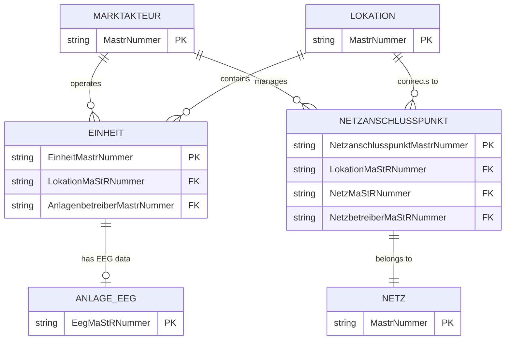
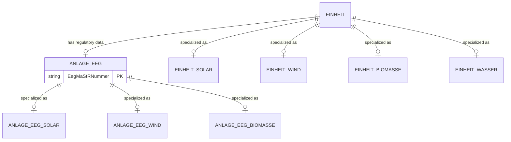
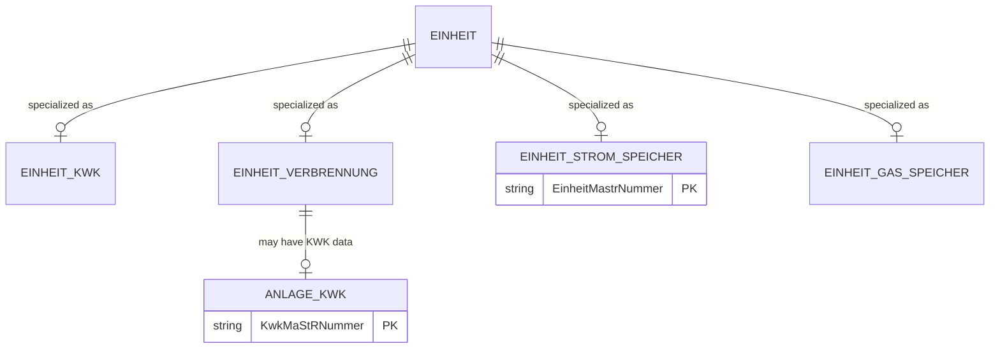
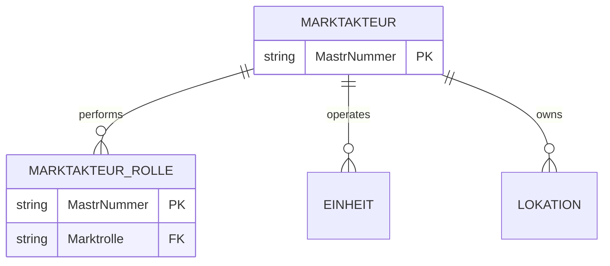

# MaStR Data Relationships

The following diagrams illustrate the dependencies between entities in the Marktstammdatenregister (MaStR) data model, categorized by domain.

## Overview: Primary Dependencies

This high-level view shows the fundamental connections between Market Actors, Locations, Units, and the Grid.

## 1. Core Infrastructure & Geography

This domain covers how physical units are anchored to geographic locations and the electrical grid.

## 2. Renewable Energy Units (EEG)

Renewable units consist of a technical "Unit" entry and a corresponding "EEG-Anlage" entry containing regulatory data.

## 3. Conventional Generation & Storage

This domain includes combined heat and power (KWK), combustion plants, and energy storage systems.

## 4. Market Actors & Roles

Entities describing the organizations and roles (Operators, Grid Operators, etc.) in the market.

### Key Relationships Explained

- **Units & Locations**: Every unit (Solar, Wind, etc.) is physically tied to a Geographic Location (`LokationMaStRNummer`).
- **EEG & KWK Links**: Regulatory subsidies (EEG/KWK) are often managed in separate lookup tables linked by their specific MaStR numbers.
- **Inheritance**: The schema uses a pseudo-inheritance model where common fields are in the base `Einheit` table and specific technical parameters are in type-specific tables.
