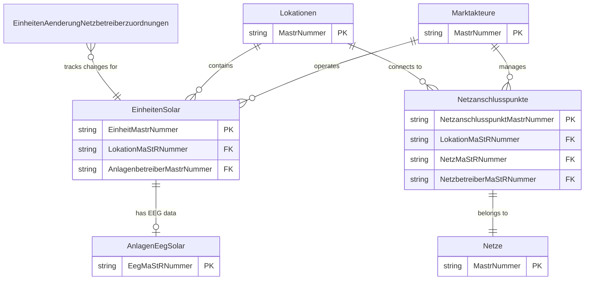
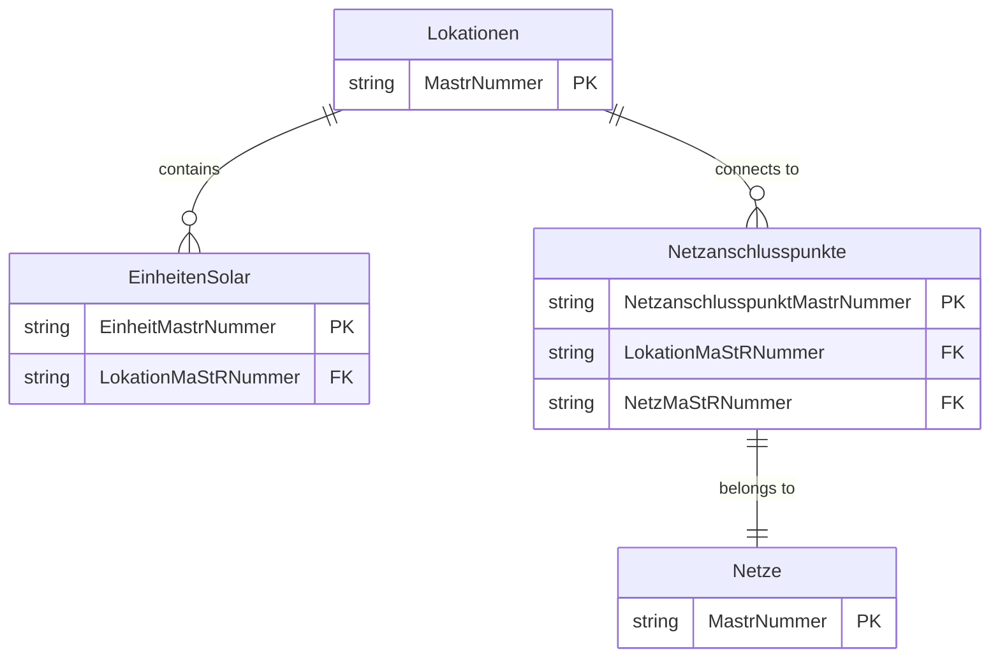
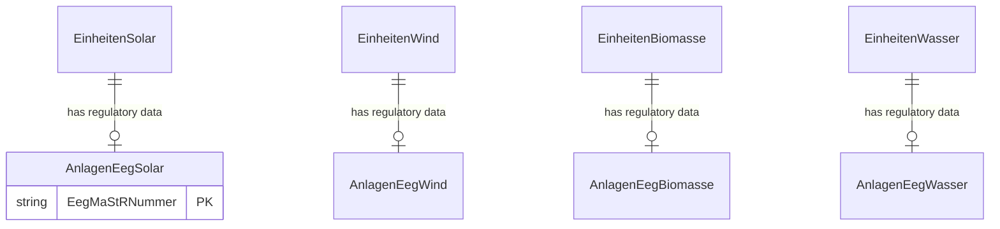
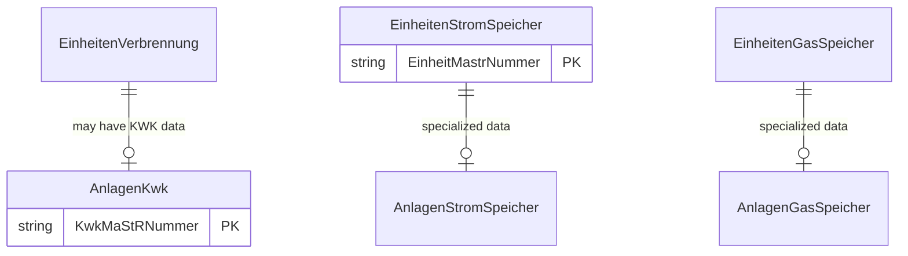
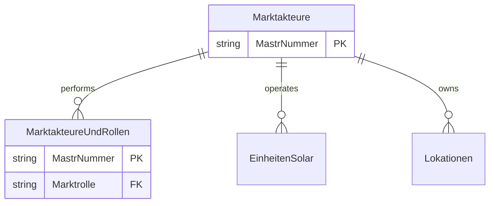
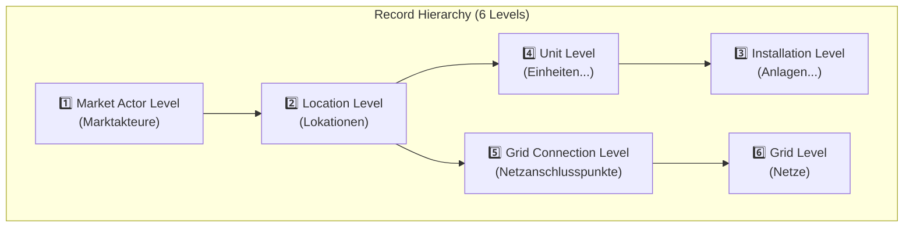
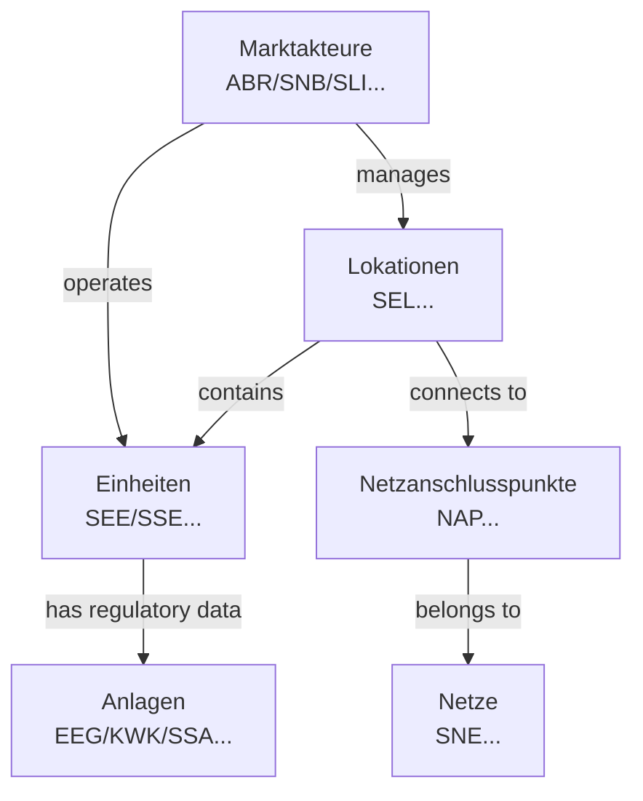

# MaStR Data Relationships

The following diagrams illustrate the dependencies between entities in the Marktstammdatenregister (MaStR) data model, categorized by domain.

> [!NOTE]
> **Naming Convention**: The entity names in these diagrams match the exact keys found in `schema.json` (which correspond to the XML filenames in `bulk.zip`).

## Overview: Primary Dependencies

This high-level view shows the fundamental connections between Market Actors, Locations, Units, and the Grid.

## 1. Core Infrastructure & Geography

This domain covers how physical units are anchored to geographic locations and the electrical grid.

## 2. Renewable Energy Units (EEG)

Renewable units consist of a technical "Einheit" entry and a corresponding "AnlageEeg" entry containing regulatory data. They are linked via their specific MaStR numbers.

## 3. Conventional Generation & Storage

This domain includes combined heat and power (KWK), combustion plants, and energy storage systems.

## 4. Market Actors & Roles

Entities describing the organizations and roles (Operators, Grid Operators, etc.) in the market.

### Key Relationships Explained

- **Units & Locations**: Every specific unit (e.g., `EinheitenSolar`, `EinheitenWind`) is physically tied to a Geographic Location (`LokationMaStRNummer`).
- **EEG & KWK Links**: Regulatory subsidies (EEG/KWK) are managed in separate entities (e.g., `AnlagenEegSolar`) linked to the unit.
- **Change Tracking**: `EinheitenAenderungNetzbetreiberzuordnungen` (previously referred to as "UNIT_CHANGES") tracks history and audit logs for unit assignments to grid operators.
- **Entity Identity**: All major objects use a `MastrNummer` (or variant like `EinheitMastrNummer`) as a unique identifier across the entire system.

---

## Record Hierarchy Levels

The MaStR data model organizes records at different granularity levels. Understanding these levels is essential for data processing and aggregation.

### 1. Market Actor Level (`Marktakteure`)

The highest organizational level representing companies and organizations participating in the energy market.

| Identifier Pattern | Description                       |
| ------------------ | --------------------------------- |
| `ABR...`           | Anlagenbetreiber (Plant Operator) |
| `SNB...`           | Netzbetreiber (Grid Operator)     |
| `SLI...`           | Lieferant (Supplier)              |

**Related Files**: `Marktakteure.xml`, `MarktakteureUndRollen.xml`

---

### 2. Location Level (`Lokationen`)

Physical geographic locations where energy units are installed.

| Identifier Pattern | Description         |
| ------------------ | ------------------- |
| `SEL...`           | Lokation (Location) |

**Key Fields**: `MastrNummer`, `Gemeindeschluessel` (AGS), `Postleitzahl` (PLZ)

**Related Files**: `Lokationen.xml`

---

### 3. Installation Level (`Anlagen...`)

Regulatory and subsidy-related data for installations. These contain EEG/KWK regulatory information linked to units.

| Identifier Pattern | Entity Type          | Description                           |
| ------------------ | -------------------- | ------------------------------------- |
| `EEG...`           | AnlagenEegSolar      | EEG regulatory data for solar         |
| `EEG...`           | AnlagenEegWind       | EEG regulatory data for wind          |
| `EEG...`           | AnlagenEegBiomasse   | EEG regulatory data for biomass       |
| `EEG...`           | AnlagenEegWasser     | EEG regulatory data for hydro         |
| `KWK...`           | AnlagenKwk           | Combined heat/power installation data |
| `SSA...`           | AnlagenStromSpeicher | Storage installation data             |
| `GSA...`           | AnlagenGasSpeicher   | Gas storage installation data         |

**Related Files**: `AnlagenEegSolar.xml`, `AnlagenEegWind.xml`, `AnlagenKwk.xml`, `AnlagenStromSpeicher.xml`, etc.

---

### 4. Unit Level (`Einheiten...`)

The core technical records for individual energy-generating or storage units.

| Identifier Pattern | Entity Type            | Description           |
| ------------------ | ---------------------- | --------------------- |
| `SEE...`           | EinheitenSolar         | Solar PV units        |
| `SEE...`           | EinheitenWind          | Wind turbines         |
| `SEE...`           | EinheitenBiomasse      | Biomass units         |
| `SEE...`           | EinheitenWasser        | Hydro units           |
| `SSE...`           | EinheitenStromSpeicher | Battery/storage units |
| `SGE...`           | EinheitenGasSpeicher   | Gas storage units     |
| `SEE...`           | EinheitenVerbrennung   | Combustion units      |
| `SEE...`           | EinheitenGeothermie    | Geothermal units      |
| `SEE...`           | EinheitenKernkraft     | Nuclear units         |

**Key Fields**: `EinheitMastrNummer`, `LokationMaStRNummer`, `Inbetriebnahmedatum`, `Nettonennleistung`

**Related Files**: `EinheitenSolar.xml`, `EinheitenStromSpeicher.xml`, `EinheitenWind.xml`, etc.

---

### 5. Grid Connection Level (`Netzanschlusspunkte`)

Connection points between locations and the electrical grid.

| Identifier Pattern | Description                                |
| ------------------ | ------------------------------------------ |
| `NAP...`           | Netzanschlusspunkt (Grid Connection Point) |

**Key Fields**: `NetzanschlusspunktMaStRNummer`, `LokationMaStRNummer`, `NetzMaStRNummer`, `NetzbetreiberMaStRNummer`

**Related Files**: `Netzanschlusspunkte.xml`

---

### 6. Grid Level (`Netze`)

Electrical grid infrastructure.

| Identifier Pattern | Description                  |
| ------------------ | ---------------------------- |
| `SNE...`           | Stromnetz (Electricity Grid) |

**Related Files**: `Netze.xml`

---

### Summary: Hierarchy Diagram

> [!TIP]
> When processing data, unit-level records (`Einheiten...`) are the most granular and contain the technical specifications. Installation-level records (`Anlagen...`) provide regulatory context and should be joined via their respective MaStR numbers.
