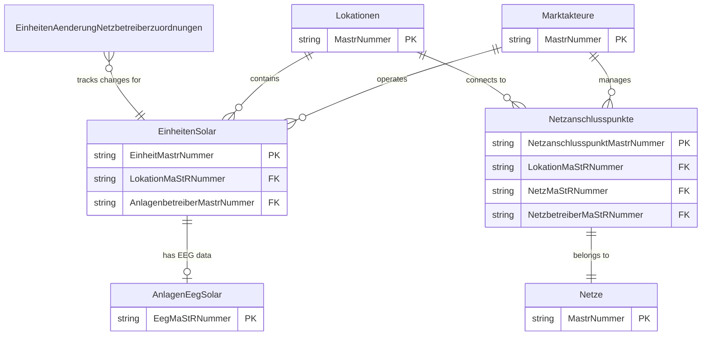
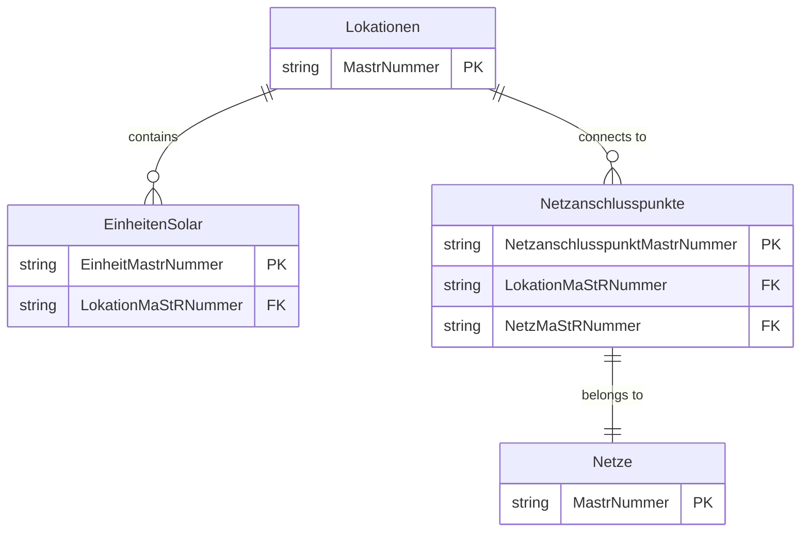
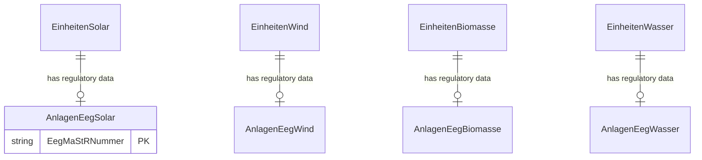
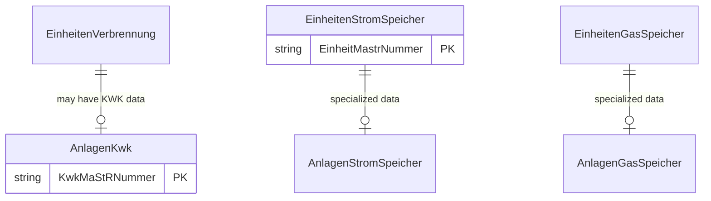
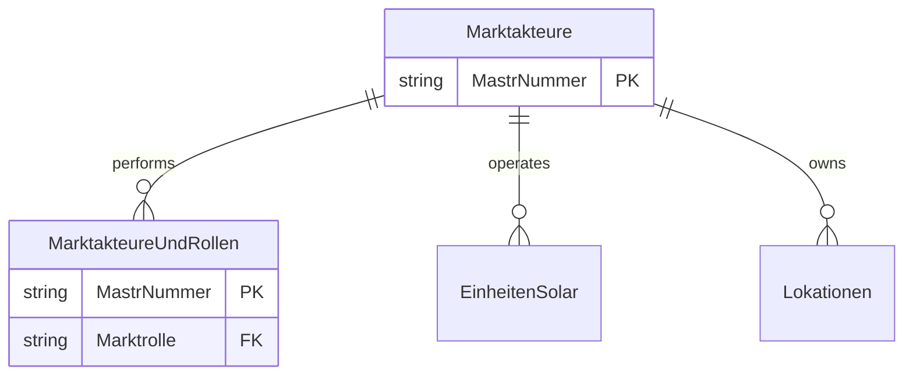

# MaStR Data Relationships

The following diagrams illustrate the dependencies between entities in the Marktstammdatenregister (MaStR) data model, categorized by domain.

> [!NOTE]
> **Naming Convention**: The entity names in these diagrams match the exact keys found in `schema.json` (which correspond to the XML filenames in `bulk.zip`).

## Overview: Primary Dependencies

This high-level view shows the fundamental connections between Market Actors, Locations, Units, and the Grid.

## 1. Core Infrastructure & Geography

This domain covers how physical units are anchored to geographic locations and the electrical grid.

## 2. Renewable Energy Units (EEG)

Renewable units consist of a technical "Einheit" entry and a corresponding "AnlageEeg" entry containing regulatory data. They are linked via their specific MaStR numbers.

## 3. Conventional Generation & Storage

This domain includes combined heat and power (KWK), combustion plants, and energy storage systems.

## 4. Market Actors & Roles

Entities describing the organizations and roles (Operators, Grid Operators, etc.) in the market.

### Key Relationships Explained

- **Units & Locations**: Every specific unit (e.g., `EinheitenSolar`, `EinheitenWind`) is physically tied to a Geographic Location (`LokationMaStRNummer`).
- **EEG & KWK Links**: Regulatory subsidies (EEG/KWK) are managed in separate entities (e.g., `AnlagenEegSolar`) linked to the unit.
- **Change Tracking**: `EinheitenAenderungNetzbetreiberzuordnungen` (previously referred to as "UNIT_CHANGES") tracks history and audit logs for unit assignments to grid operators.
- **Entity Identity**: All major objects use a `MastrNummer` (or variant like `EinheitMastrNummer`) as a unique identifier across the entire system.
